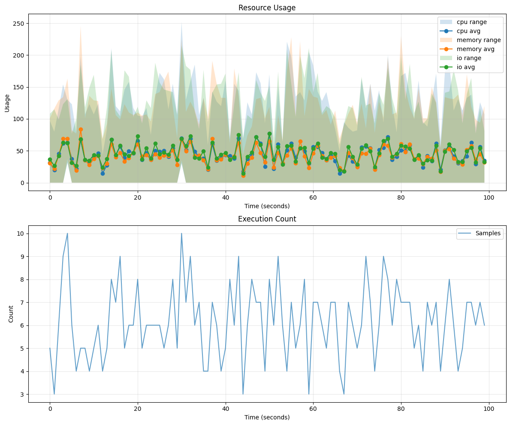

# ALERTWest Interview Question 1

## Instructions

1. Hard fork this repository (git clone + new remote) to create your own private copy.
2. Add the following users as collaborators to your private repository: @ehiggins0, @jlang-dp, and @chrisschreiber.
3. Work through the tasks outlined in the Overview section.
4. Make frequent, small PRs as you complete portions of the work. Request review for each PR and we will provide feedback on your approach.
5. Document your approach, any assumptions made, and your reasoning for design decisions.

Feel free to reach out if you have any questions or need clarification on any aspect of the problem. We're here to help ensure you understand the requirements fully.

## Overview

You are working on a database that is having performance issues with an unknown cause. The current monitoring is showing an average within operating standards for CPU, memory, and disk usage, but has very high maximums.

Provided in this repo is a server and client. The server is the executor of queries, and the client is set up to monitor the database's utilization (cpu, io, and memory). An attempt has been made to also monitor which queries are being executed, but the method is not currently effective. Your task is to improve the system by addressing these issues, first by improving the query monitoring, then by implementing query scheduling to ensure consistent performance.

## General Requirements

- The system must recover from network or client failures without losing data or significant progress
- Provide a method to run the services locally
- Provide frequent PRs as you complete work

## Use of AI Tools

While AI tools are permitted, we are looking for a good understanding of the implemented solution. You should expect follow-up questions regarding design and code decisions made throughout the problem, and inability to explain why you made certain decisions will be taken into account.

## Current Implementation

### Lib

The `lib` package implements the core in-memory database simulation, including query scheduling, execution daemon, and resource monitoring. It exposes a high-level `DB` type that glues together these components and provides a clean interface for the server and client layers.

#### Components

- **Queue**  
  Manages pending queries (`QueuedOperation`), their execution times, and supports dynamic delay adjustments.
- **Daemon**  
  A background worker that pulls operations from the queue at each tick, executes them, and emits resource‐usage updates.
- **Monitor**  
  Collects and aggregates CPU, memory, and I/O statistics at a configurable frequency and makes them available to clients.

#### Public Functions

- `func NewDB() *DB`  
  Factory function that:
  1. Loads 100 dummy queries and their execution probabilities.
  2. Sets default tick delay (1 tick = 100 ms) and tick rate (10 ticks/sec).
  3. Configures a 1 second metrics‐update frequency.
  4. Initializes inter‐component channels and returns a ready‐to‐run `DB` instance.

#### DB Methods

- `func (d *DB) Run()`  
  Launches the monitor and daemon in separate goroutines, kicking off query execution and metrics collection.

- `func (d *DB) AddQueueListener(listener chan *QueuedOperation)`  
  Registers a channel to receive live updates whenever a new operation enters the queue.

- `func (d *DB) GetQueued() []*QueuedOperation`  
  Returns a snapshot of all currently queued operations.

- `func (d *DB) GetResources() *ResourceMetrics`  
  Retrieves the most recent aggregated resource usage metrics.

- `func (d *DB) Delay(id uuid.UUID, delay int) error`  
  Applies an additional delay (measured in ticks) to a scheduled query execution.

### Server (Backend Service)

The `server` package implements the HTTP API for interacting with the in-memory database simulation. It registers handlers for retrieving queued operations, fetching resource metrics, and delaying specific query executions.

#### Endpoints

- `GET /queued`  
  Returns the list of currently queued (but not yet executed) queries. Example response:

  ```json
  {
    "query": {
      "id": "550e8400-e29b-41d4-a716-446655440000"
    },
    "execution": {
      "id": "a7e3f4c2-9b8d-5e6f-7c0a-1d2b3c4d5e6f",
      "timestamp": 1740000000000
    }
  }
  ```

- `GET /resources`  
  Retrieves the most recent resource utilization metrics (CPU, I/O, memory) aggregated over the last second. Example response:

  ```json
  {
    "cpu": {
      "average": 50,
      "min": 30,
      "max": 70
    },
    "io": {
      "average": 50,
      "min": 30,
      "max": 70
    },
    "memory": {
      "average": 50,
      "min": 30,
      "max": 70
    },
    "timestamp": 1740000000000
  }
  ```

- `POST /delay`  
  Applies an additional delay (in ticks) to a scheduled query execution. Request body:

  ```json
  {
    "id": "a7e3f4c2-9b8d-5e6f-7c0a-1d2b3c4d5e6f",
    "delay": 10
  }
  ```

> [!NOTE]
> You should only need to modify the `server` directory for core functionality, but you may want to review `lib`.

### Client (Monitoring Service)

The `client` package polls the server endpoints at regular intervals but does not currently process or act on the retrieved data.

#### Polling Behavior

- Polls `GET /queued` and `GET /resources` every second; responses are currently not processed.

# Exercise
Please read through the entire exercise before starting to work on it.  The exercise is broken into two parts, and you will need to complete Part 1 before starting Part 2.  The two parts are related, but can be completed independently.  However, you should not start working on Part 2 until you have a solution for Part 1.
Before you start on code implementation, open a pull request with your proposed solution in a `SOLUTION.md` file. You should include details as outlined in the below segments.

> [!NOTE]
> We are looking for a solution that can be run locally, so please include instructions on how to run the server and client locally.

## Part 1: Identify Queries being Executed
> [!NOTE]
> Hint: Review Part 2 before settling on a solution to Part 1.  Your solution in Part 1 will be necessary to understand which queries are in the queue pending execution.

### Problem

We are currently polling the `/queued` endpoint every second to get a picture of the query patterns on the server, but we're missing data - some queries are rare (or too fast) and we need to make sure that we capture everything.

### Objective

Develop a reliable mechanism to record all queries executed by the backend service.

### Requirements

- Capture every executed query, regardless of execution duration or frequency
- Ensure the system can withstand network or client failures without losing data

### Deliverables

- Modify the server and client to support your selected architecture.
- Include inline and readme documentation regarding architectural decisions made throughout the process

### Your Solution Overview
Please find the `SOLUTION.md` in the root directory to add your solution details.

## Part 2: Optimize Query Schedule

### Problem

Now that we have a complete query execution record and associated usage metrics, we decide that we want to mitigate the resource spikes in the database. Queries are scheduled with a default 100ms delay after being queued, and the `POST /delay` endpoint allows further postponement.

### Objective

Optimize query execution scheduling to maintain a minimum and maximum CPU, IO and memory utilization within 10% of the averages, while also taking query latency into account.

### Requirements

- Develop a client-side algorithm to estimate each query's resource utilization (CPU, IO, and memory) using historical execution data and the 1-second resource metrics
- Create a client-side algorithm to determine when to execute queries, adjusting delays to achieve the +/- 10% spread from the average
- Ensure the client can be restarted and resume scheduling based on the system state.

### Deliverables

- Update the client code to schedule queries using the appropriate algorithms
- Document the system you've designed and how your approach achieves the targeted utilization

### Part 2: Your Solution Overview
Please find the `SOLUTION.md` in the root directory to add your solution details.

## Frequently Asked Questions

### What is lib, and what can be used / modified in it?

Lib is the implementation of our "database". It randomly selects "queries", then executes them depending on the parameters defined in [db](./lib/db.go).

All exported functions can be used in your solution. While you should not need to modify any part of lib to solve this problem, you can change the parameters in `db` to make the problem easier / harder. Your final solution should support basically any set of parameters.

### Can additional services be added?

Yes, you may add services on an as needed basis, as long as the services are open source and the entire application can be ran locally and started with a single command.

### Where can additional questions be asked?

We encourage you to frequently ask questions while working on this question. We are more than willing to clarify anything you're uncertain about, validate your solution before implementation, or just give feedback on ideas. Feel free to include questions in PRs or reach out to us via email, Slack, or Discord, and we will try to get back to you same-day.
